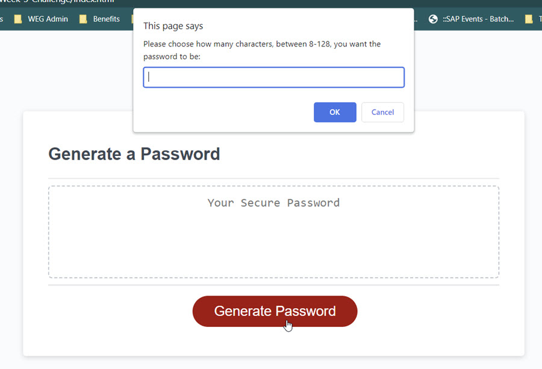
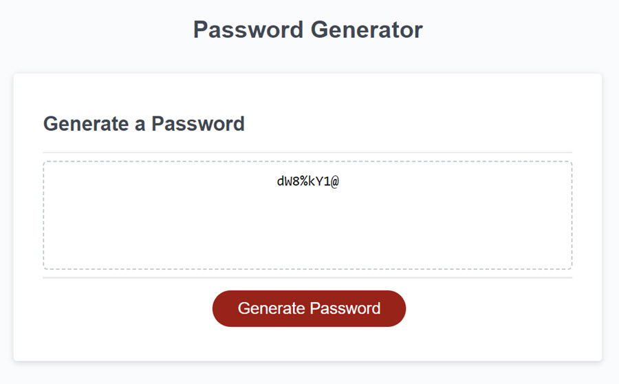

# Week 3 Challenge

## Description

This project is to showcase my understanding of javascript basics. This is done by creating a password generator. Application will ask user to input how long the password should and if they want lower case, upper case, numbers, and/or special characters in the password. Once all criteria is taken in, the application will generate a password based on user critera.

How the popups should come up for users to select their password critera:

How a successful password is generated:

## Installation

No installations needed, but will need access to final project link and github. That will be provided in the Usage section.

## Usage

To see the final project please see the links below:

GitHub link: https://github.com/luxardOri/Week-3-Challenge/  
Final project link: https://luxardori.github.io/Week-3-Challenge/

You can see the html used by either clicking on the gitHub link or by inspecting the final project link.

## Credits

Here are the websites I've referenced:

This was used to see how to keep looping through until a satisfactory answer is provided:  
https://stackoverflow.com/questions/70121800/keep-showing-prompt-until-correct-value-is-given-in-javascript

These sites were used to understand how to generate passwords and how to properly use the Math.random() function.  
https://webdesign.tutsplus.com/tutorials/build-a-configurable-random-password-generator-with-javascript--cms-93262  
https://dev.to/code_mystery/random-password-generator-using-javascript-6a